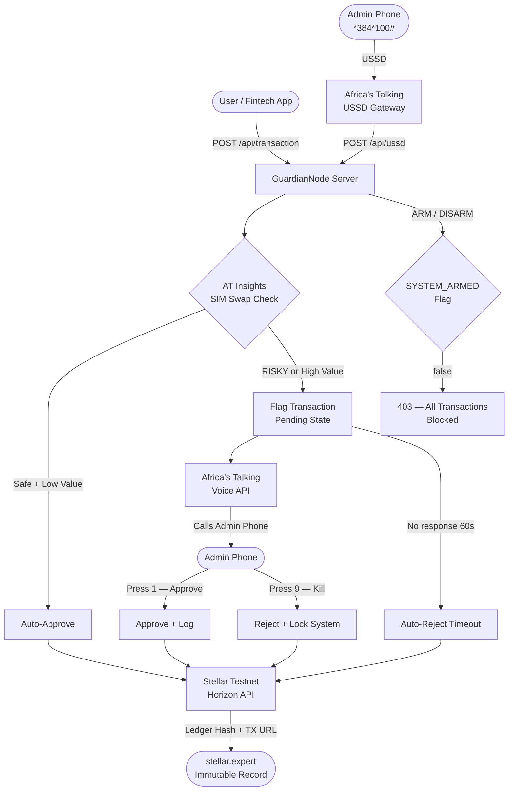

# GuardianNode

GuardianNode is a professional, security-focused transaction monitoring and fraud interception system. It provides real-time oversight of financial activities, integrating SIM-Swap detection (48-hour window), a physical Voice Gate for high-stakes authorisation, an emergency USSD kill switch, and an immutable blockchain audit trail on the Stellar Testnet.

## Key Features

- **Real-Time Dashboard** — Dark-themed interface for monitoring live transactions and API health.
- **SIM-Swap Detection** — Flags any transaction where the recipient's SIM was swapped within the last 48 hours.
- **Voice Gate Authorization** — Triggers a live phone call to the admin for critical approvals via Africa's Talking Voice API. Press **1** to approve, **9** to kill and lock down.
- **USSD Kill Switch** — Dial `*384*100#` from any phone to remotely ARM or DISARM the system entirely.
- **60-Second Timeout** — Pending transactions auto-rejected if no admin response within 60 seconds.
- **Immutable Audit Logs** — Every transaction is hashed and committed to the Stellar Testnet ledger with a verifiable explorer link.

## Architecture



## Tech Stack

- **Frontend**: React, Vite, Tailwind CSS, Recharts, Lucide React
- **Backend**: Node.js, Express
- **Integrations**:
  - **Africa's Talking**: Voice API (admin calls), USSD (kill switch), Insights API (SIM swap)
  - **Stellar**: Horizon Testnet for decentralised, immutable transaction logging

## Project Structure

```text
GuardianNode/
├── client/                    # React frontend (Vite)
│   └── src/
│       └── components/
│           ├── Dashboard.jsx
│           ├── TransactionSimulator.jsx
│           ├── FraudModal.jsx
│           └── KillSwitch.jsx
├── server/                    # Express backend
│   ├── services/
│   │   ├── africasTalkingService.js
│   │   └── stellarService.js
│   ├── index.js               # All routes + business logic
│   ├── generate_keys.js       # Stellar keypair generator
│   ├── .env                   # Real credentials (git-ignored)
│   └── .env.example           # Credential template
└── README.md
```

## Setup & Installation

### Prerequisites
- Node.js v18+
- Africa's Talking account with API key and a Virtual Number
- Stellar Testnet keypair (run `node server/generate_keys.js` to generate one)
- A public tunnel (e.g. [ngrok](https://ngrok.com)) so Africa's Talking can reach your server

### 1. Server Setup
```bash
cd server
npm install
cp .env.example .env   # Fill in your real credentials
npm run dev
```

### 2. Client Setup
```bash
cd client
npm install
npm run dev
```

### 3. Expose the Server (for live AT callbacks)
```bash
ngrok http 3001
# Copy the https URL into your .env as AT_CALLBACK_URL
# Set it as the callback URL in your Africa's Talking dashboard
```

## Environment Variables

| Variable | Description |
| :--- | :--- |
| `PORT` | Backend port (default: 3001) |
| `MOCK_MODE` | Set `true` to run without live AT/Stellar credentials |
| `AT_USERNAME` | Africa's Talking username (e.g. `sandbox`) |
| `AT_API_KEY` | Africa's Talking API key |
| `AT_VIRTUAL_NUMBER` | Your AT virtual phone number |
| `AT_ADMIN_PHONE` | Real mobile number that receives the voice authorization call |
| `AT_CALLBACK_URL` | Your public ngrok URL (e.g. `https://xyz.ngrok-free.app`) |
| `STELLAR_PUBLIC_KEY` | Stellar Testnet public key |
| `STELLAR_SECRET_KEY` | Stellar Testnet secret key |

## Voice Gate Flow

| Admin Action | DTMF | Result |
| :--- | :--- | :--- |
| Approve transaction | Press **1** | Transaction approved, logged to Stellar |
| Kill transaction + lock system | Press **9** | Transaction rejected, `SYSTEM_ARMED = false`, all further requests blocked with `403` |
| No response | (timeout) | Transaction auto-rejected after 60 seconds |

## USSD Kill Switch (`*384*100#`)

| Input | Action |
| :--- | :--- |
| `1` | ARM — restore normal operation |
| `2` | Emergency Lockdown — block all transactions |
| `3` | Check current system status |

## Security Note

This repository uses `.gitignore` to ensure `.env` is never committed. Always use `.env.example` as your configuration template.

---
Built for secure financial ecosystems by Kavengi Lilian Kathini.
